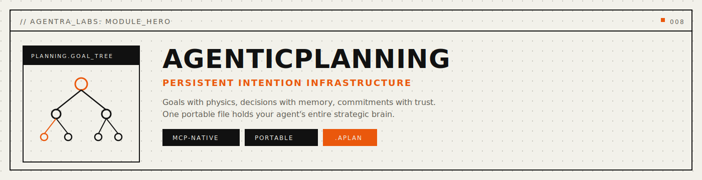
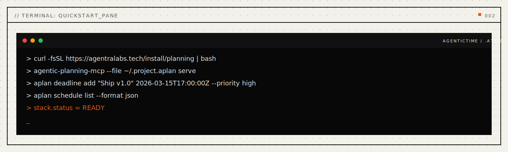
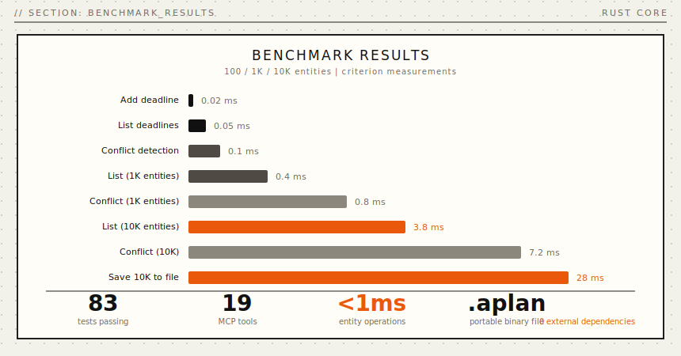
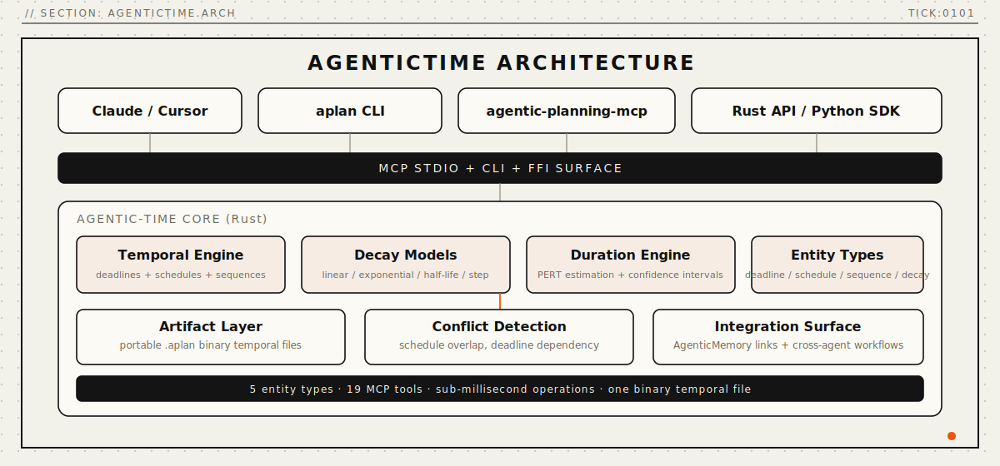

<p align="center">
  
</p>

<p align="center">
  <a href="https://crates.io/crates/agentic-planning"></a>
  
  
</p>

<p align="center">
  <a href="#install"></a>
  <a href="#install"></a>
  <a href="#mcp-server"></a>
  <a href="LICENSE"></a>
  <a href="paper/paper-i-intention-format/agenticplanning-paper.pdf"></a>
  <a href="docs/api-reference.md"></a>
</p>

<p align="center">
  <strong>Persistent intention infrastructure for AI agents.</strong>
</p>

<p align="center">
  <em>Goals with physics. Decisions with memory. Commitments with trust. One file holds your agent's entire strategic brain.</em>
</p>

<p align="center">
  <a href="#architecture">Architecture</a> · <a href="#quickstart">Quickstart</a> · <a href="#problems-solved">Problems Solved</a> · <a href="#how-it-works">How It Works</a> · <a href="#why-agentic-planning">Why</a> · <a href="#mcp-tools">MCP Tools</a> · <a href="#benchmarks">Benchmarks</a> · <a href="#install">Install</a> · <a href="docs/api-reference.md">API</a> · <a href="paper/paper-i-intention-format/agenticplanning-paper.pdf">Papers</a>
</p>

---

## Every AI agent forgets what it wanted.

Claude starts a coding session with five goals — by the end, three are abandoned and nobody remembers why. GPT commits to a deadline, then the next session treats it as a suggestion. Your copilot decomposes a task into subtasks, and by session three the subtask tree is gone. **Every plan starts from zero.**

The current fixes don't work. Todo lists lose hierarchy — you get flat items, never *"which goal does this serve?"*. Session notes are ephemeral and break across restarts. Kanban boards are external and disconnected from the agent's reasoning. Provider memory captures facts but never intentions.

**AgenticPlanning** stores your agent's strategic state as a living intention graph in a single binary file. Not "write down your goals." Your agent has a **strategic brain** — goals with physics, decisions with preserved shadow paths, commitments with trust accounting, and progress with momentum — all connected, all queryable in microseconds.

<a name="problems-solved"></a>

## Problems Solved (Read This First)

- **Problem:** goal drift — agents lose track of objectives across sessions.
  **Solved:** persistent `.aplan` files preserve the full goal hierarchy with status, priority, blockers, and relationships that survive restarts, model switches, and long gaps.
- **Problem:** decision amnesia — shadow paths and rejected alternatives vanish.
  **Solved:** decision crystallization preserves every option considered, the reasoning chain, and the roads not taken.
- **Problem:** commitment overload — agents take on too many promises with no accountability.
  **Solved:** weighted commitment tracking with stakeholder entanglement, deadline physics, and at-risk forecasting.
- **Problem:** progress blindness — no momentum, no velocity, no forecasts.
  **Solved:** progress physics engine computes momentum, gravity wells, blocker echoes, and completion forecasts.
- **Problem:** strategic isolation — goals exist in a vacuum, disconnected from decisions and commitments.
  **Solved:** intention singularity collapses the full strategic state into a unified view with tension detection and theme extraction.

```python
from agentic_planning import PlanningGraph

planner = PlanningGraph("strategy.aplan")

# Your agent plans
planner.create_goal("Ship v2.0", intention="Complete rewrite with new architecture")

# View all goals
goals = planner.list_goals()
```

CLI for operational workflows:

```bash
aplan goal create "Ship v2.0" --intention "Complete rewrite with new architecture"
aplan decision create --goal g-001 --question "Which runtime?" --option "Tokio" --option "async-std"
aplan commitment create --goal g-001 --promise "Demo by Friday" --stakeholder "team-lead"
aplan singularity --file strategy.aplan
```

One file holds everything. Works with Claude, GPT, Ollama, or any LLM you switch to next.

<p align="center">
  
</p>

---

<a name="architecture"></a>

## Architecture

> **v0.1.0** — Persistent intention infrastructure.

AgenticPlanning is a Rust-native planning engine that treats strategic state as first-class data. Goals are living entities with physics. Decisions crystallize from option spaces, preserving shadow paths. Commitments carry weight and trust. Progress has momentum.

### Core Capabilities

- **Goal Engine** — Goals with hierarchy, physics, lifecycle, dream simulation, reincarnation, and decomposition.
- **Decision Engine** — Crystallization with shadow path preservation, archaeology, prophecy, regret analysis, and counterfactual projection.
- **Commitment Tracker** — Weighted promises with stakeholder entanglement, deadline physics, renegotiation, and at-risk forecasting.
- **Query Engine** — Singularity collapse, intention position, path analysis, tension detection, theme extraction, and center-of-gravity.
- **Progress Physics** — Momentum, gravity wells, blocker echoes, velocity tracking, trend analysis, and completion forecasts.
- **Dream Surfaces** — Goal dreaming, collective dreaming, interpretation, insight extraction, and accuracy tracking.
- **Federation** — Cross-agent goal sharing, sync, handoff, and status propagation.
- **Consensus** — Multi-stakeholder decision workflows with rounds, voting, synthesis, and crystallization.

### Architecture Overview

```
+-------------------------------------------------------------+
|                     YOUR AI AGENT                           |
|           (Claude, Cursor, Windsurf, Cody)                  |
+----------------------------+--------------------------------+
                             |
                  +----------v----------+
                  |      MCP LAYER      |
                  |   13 Tools + 9 Res  |
                  +----------+----------+
                             |
+----------------------------v--------------------------------+
|                    PLANNING ENGINE                           |
+-----------+-----------+------------+----------+-------------+
| Goal      | Decision  | Commitment | Progress | Query       |
| Engine    | Engine    | Tracker    | Physics  | Engine      |
+-----------+-----------+------------+----------+-------------+
                             |
                  +----------v----------+
                  |     .aplan FILE     |
                  |  (your intentions)  |
                  +---------------------+
```

---

<a name="mcp-tools"></a>

## MCP Tools

AgenticPlanning exposes **13 MCP tools** for AI agents:

### Planning Tools

| Tool | Description | Operations |
|:---|:---|:---|
| `planning_goal` | Living goal management with full lifecycle support | create, list, show, activate, progress, complete, abandon, pause, resume, block, unblock, decompose, link, tree, feelings, physics, dream, reincarnate |
| `planning_decision` | Decision crystallization with shadow path preservation | create, option, crystallize, show, shadows, chain, archaeology, prophecy, counterfactual, regret, recrystallize |
| `planning_commitment` | Weighted commitment management | create, list, show, fulfill, break, renegotiate, entangle, inventory, due_soon, at_risk |
| `planning_progress` | Progress physics | momentum, gravity, blockers, echoes, forecast, velocity, trend |
| `planning_singularity` | Intention singularity | collapse, position, path, tensions, themes, center, vision |
| `planning_dream` | Dream surfaces | goal, collective, interpret, insights, accuracy, history |
| `planning_counterfactual` | Counterfactual projection | project, compare, learn, timeline |
| `planning_chain` | Decision chain analysis | trace, cascade, roots, leaves, visualize |
| `planning_consensus` | Consensus workflows | start, round, synthesize, vote, status, crystallize |
| `planning_federate` | Goal federation | create, join, sync, handoff, status, members |
| `planning_metamorphosis` | Goal metamorphosis | detect, approve, history, predict, stage |
| `planning_workspace` | Workspace management | create, switch, list, compare, merge, delete |
| `planning_context_log` | Log the intent and context behind a planning action | (direct params: intent, finding, topic) |

### MCP Resources

```
planning://goals             -- All goals
planning://goals/{id}        -- Goal by ID
planning://decisions         -- All decisions
planning://commitments       -- All commitments
planning://singularity       -- Current intention singularity
planning://status            -- Planning status overview
planning://dreams/{id}       -- Dream detail by ID
planning://consensus/{id}    -- Consensus session state
planning://workspace/{id}    -- Workspace summary
```

### MCP Prompts

| Prompt | Description |
|:---|:---|
| `planning_review` | Generate planning review (daily/weekly/monthly) |
| `goal_decomposition` | Decompose a goal into sub-goals |
| `decision_analysis` | Analyze a pending decision |
| `commitment_check` | Check commitment health |

---

<a name="benchmarks"></a>

## Benchmarks

Rust core. Atomic file I/O. Zero external dependencies. Real numbers from Criterion statistical benchmarks:

<p align="center">
  
</p>

| Operation | Time | Scale |
|:---|---:|:---|
| Create goal | **340 ns** | 1K graph |
| Create decision | **480 ns** | 1K graph |
| Goal hierarchy | **2.5 ms** | 1K graph |
| Singularity view | **7.1 ms** | 1K graph |
| Decision tree | **1.3 ms** | 1K graph |
| Dream simulation | **9.5 ms** | 1K graph |
| Write 1K goals to file | **28.4 ms** | -- |
| Read 1K goals from file | **3.1 ms** | -- |

> All benchmarks measured with Criterion (100 samples) on Apple M4 Pro, 64 GB, Rust 1.90.0 `--release`.

**Capacity:** A year of intensive planning produces a ~6 MB file. A decade fits in ~60 MB. Zero external database dependencies.

<details>
<summary><strong>Comparison with existing systems</strong></summary>

<br>

| | Todo Apps | Session Notes | Kanban APIs | **AgenticPlanning** |
|:---|:---:|:---:|:---:|:---:|
| Goal hierarchy | None | None | Flat lists | **Unlimited depth** |
| Decision preservation | None | Text only | None | **Full crystallization** |
| Shadow paths | None | None | None | **Yes** |
| Commitment tracking | None | None | Basic | **Weighted + entangled** |
| Progress physics | None | None | None | **Momentum + gravity** |
| Portability | Vendor-locked | File-based | API-locked | **Single file** |
| External dependencies | Cloud service | None | Cloud service | **None** |
| Counterfactual analysis | No | No | No | **Yes** |
| Dream simulation | No | No | No | **Yes** |
| Federation | No | No | No | **Yes** |

</details>

---

<a name="why-agentic-planning"></a>

## Why AgenticPlanning

**Planning is a graph, not a checklist.** When you trace *why* you're working on a task, you traverse a chain: task <- serves <- goal <- justified by <- decision <- weighed against <- alternatives. That's graph navigation. Flat todo lists can never reconstruct this.

**One file. Truly portable.** Your entire strategic state is a single `.aplan` file. Copy it. Back it up. Version control it. No cloud service, no API keys, no vendor lock-in.

**Any LLM, any time.** Start with Claude today. Switch to GPT tomorrow. Move to a local model next year. Same intention file. Same strategic continuity.

**Shadow paths preserved.** When a decision crystallizes, the rejected options don't disappear. They're preserved as shadow paths — recoverable for regret analysis, counterfactual projection, and recrystallization.

**Goals are living entities.** Goals have lifecycle (active, paused, blocked, completed, abandoned), physics (momentum, gravity), feelings (dreaming, metamorphosis), and relationships (parent, child, blocked_by, enables). They're not items on a list — they're organisms in an ecosystem.

---

<a name="install"></a>

## Install

**One-liner** (desktop profile, backwards-compatible):
```bash
curl -fsSL https://agentralabs.tech/install/planning | bash
```

Downloads a pre-built `agentic-planning-mcp` binary to `~/.local/bin/` and merges the MCP server into your Claude Desktop and Claude Code configs. Intentions default to `~/.strategy.aplan`. Requires `curl` and `jq`.

**Environment profiles** (one command per environment):
```bash
# Desktop MCP clients (auto-merge Claude Desktop + Claude Code when detected)
curl -fsSL https://agentralabs.tech/install/planning/desktop | bash

# Terminal-only (no desktop config writes)
curl -fsSL https://agentralabs.tech/install/planning/terminal | bash

# Remote/server hosts (no desktop config writes)
curl -fsSL https://agentralabs.tech/install/planning/server | bash
```

| Channel | Command | Result |
|:---|:---|:---|
| GitHub installer (official) | `curl -fsSL https://agentralabs.tech/install/planning \| bash` | Installs release binaries; merges MCP config |
| crates.io paired crates (official) | `cargo install agentic-planning-cli agentic-planning-mcp` | Installs `aplan` and `agentic-planning-mcp` |
| PyPI (SDK) | `pip install agentic-planning` | Python SDK |
| npm (wasm) | `npm install @agenticamem/planning` | WASM-based planning SDK for Node.js and browser |

| Goal | Command |
|:---|:---|
| **Just give me planning** | Run the one-liner above |
| **Python developer** | `pip install agentic-planning` |
| **Rust developer** | `cargo install agentic-planning-cli agentic-planning-mcp` |

<details>
<summary><strong>Detailed install options</strong></summary>

<br>

**Python SDK** (requires `aplan` Rust binary):
```bash
pip install agentic-planning
```

**Rust CLI + MCP:**
```bash
cargo install agentic-planning-cli       # CLI (aplan)
cargo install agentic-planning-mcp       # MCP server
```

**Rust library:**
```bash
cargo add agentic-planning
```

</details>

## Deployment Model

- **Standalone by default:** AgenticPlanning is independently installable and operable. Integration with AgenticMemory, AgenticTime, or AgenticContract is optional, never required.
- **Bridges available:** Optional bridge crate connects planning state to memory, time, contract, and identity systems.

| Area | Default behavior | Controls |
|:---|:---|:---|
| File path | `~/.strategy.aplan` | `--file /path/to/strategy.aplan` |
| Auth token | Read from `AGENTIC_AUTH_TOKEN` | Bearer auth on MCP server |
| Output format | Text | `--format json`, `--format table`, `--json` |
| Server mode | stdio | `--mode http --port 3000` |

---

<a name="mcp-server"></a>

## MCP Server

**Any MCP-compatible client gets instant access to persistent planning state.** The `agentic-planning-mcp` crate exposes the full PlanningEngine over the [Model Context Protocol](https://modelcontextprotocol.io) (JSON-RPC 2.0 over stdio).

```bash
cargo install agentic-planning-mcp
```

### Configure Claude Desktop

Add to `~/Library/Application Support/Claude/claude_desktop_config.json`:

```json
{
  "mcpServers": {
    "agentic-planning": {
      "command": "agentic-planning-mcp",
      "args": []
    }
  }
}
```

> Zero-config: defaults to `~/.strategy.aplan`. Override with `"args": ["--file", "/path/to/strategy.aplan"]`.

### Configure VS Code / Cursor

Add to `.vscode/settings.json`:

```json
{
  "mcp.servers": {
    "agentic-planning": {
      "command": "agentic-planning-mcp",
      "args": []
    }
  }
}
```

### What the LLM gets

| Category | Count | Examples |
|:---|---:|:---|
| **Tools** | 13 | `planning_goal`, `planning_decision`, `planning_commitment`, `planning_progress`, `planning_singularity`, `planning_dream`, `planning_counterfactual`, `planning_chain` ... |
| **Resources** | 9 | `planning://goals`, `planning://decisions`, `planning://commitments`, `planning://singularity`, `planning://status` ... |
| **Prompts** | 4 | `planning_review`, `goal_decomposition`, `decision_analysis`, `commitment_check` |

Once connected, the LLM can create goals, crystallize decisions, track commitments, compute progress physics, collapse the intention singularity, and maintain strategic continuity — all backed by the same `.aplan` binary file. [Full MCP docs ->](crates/agentic-planning-mcp/README.md)

---

<a name="quickstart"></a>

## Quickstart

### Strategic planning in 5 commands

```bash
# Create a goal
aplan goal create "Ship v2.0" --intention "Complete architecture rewrite"

# Add a decision fork
aplan decision create --goal g-001 --question "Which runtime?" \
  --option "Tokio — mature, large ecosystem" \
  --option "async-std — simpler API"

# Crystallize the decision
aplan decision crystallize d-001 --chosen 0 --reasoning "Team has Tokio experience"

# Make a commitment
aplan commitment create --goal g-001 --promise "Demo by Friday" --stakeholder "team-lead"

# View the full strategic state
aplan singularity --file strategy.aplan
```

### Python SDK

```python
from agentic_planning import PlanningGraph

planner = PlanningGraph("strategy.aplan")

# Create goals
planner.create_goal("Ship v2.0", intention="Complete rewrite")

# List all goals
goals = planner.list_goals()
```

### Cross-session continuity

```bash
# Session 1: plan
aplan goal create "Migrate to Rust" --intention "Performance and safety"
aplan decision create --goal g-001 --question "Incremental or full rewrite?"

# Session 47 — months later, different LLM, same file:
aplan goal list                          # All goals preserved
aplan singularity --file strategy.aplan  # Full strategic state
aplan decision shadows d-001             # See what was NOT chosen
```

---

## Common Workflows

1. **Review strategic state** — Get the full picture before a planning session:
   ```bash
   aplan singularity --file strategy.aplan   # Collapse everything into one view
   aplan goal tree                            # See the goal hierarchy
   ```

2. **Trace a decision chain** — Understand how you got here:
   ```bash
   aplan chain trace d-001    # Walk the reasoning chain backward
   aplan chain cascade d-001  # See downstream effects
   ```

3. **Check commitment health** — Before taking on more work:
   ```bash
   aplan commitment due-soon             # What's coming up?
   aplan commitment at-risk              # What might slip?
   aplan commitment inventory            # Full commitment load
   ```

4. **Run a counterfactual** — Explore the road not taken:
   ```bash
   aplan counterfactual project d-001 --path 1   # What if we'd chosen differently?
   aplan decision regret d-001                     # Regret analysis
   ```

5. **Dream simulation** — Let goals dream about their futures:
   ```bash
   aplan dream goal g-001        # Single goal dream
   aplan dream collective        # All goals dream together
   aplan dream insights          # Extract patterns
   ```

---

<a name="how-it-works"></a>

## How It Works

<p align="center">
  
</p>

AgenticPlanning stores strategic state as a **living intention graph** in a custom binary format. Goals are living entities with lifecycle, physics, and relationships. Decisions crystallize from option spaces, preserving shadow paths. Commitments carry stakeholder weight and deadline physics. The query engine supports singularity collapse, path analysis, tension detection, and theme extraction.

The core runtime is written in Rust for performance and safety. All state lives in a portable `.aplan` binary file — no external databases, no managed services. The MCP server exposes the full engine over JSON-RPC stdio.

---

**The intention graph in detail:**

**Goals** are living entities — with lifecycle states:

| Status | What | Example |
|:---|:---|:---|
| **Active** | Currently being pursued | "Ship v2.0 by March" |
| **Paused** | Temporarily on hold | "Evaluate new framework — waiting on benchmark" |
| **Blocked** | Cannot proceed | "Deploy to prod — blocked by security review" |
| **Completed** | Successfully achieved | "Migrate database — done" |
| **Abandoned** | Intentionally dropped | "Build custom ORM — decided to use existing" |

**Decisions** crystallize from option spaces:

| Component | What | Example |
|:---|:---|:---|
| **Question** | The decision prompt | "Which runtime should we use?" |
| **Options** | All considered paths | "Tokio", "async-std", "smol" |
| **Crystallized** | The chosen path | "Tokio — team has experience" |
| **Shadows** | The roads not taken | "async-std — simpler but less ecosystem" |
| **Reasoning** | Why this choice | "Team velocity > API simplicity" |

**Commitments** carry trust weight:

| Component | What | Example |
|:---|:---|:---|
| **Promise** | What was committed | "Demo by Friday" |
| **Stakeholder** | Who it's for | "team-lead" |
| **Weight** | How important | 0.9 (high stakes) |
| **Entanglement** | Linked commitments | "Demo depends on API completion" |

**The binary `.aplan` file** uses BLAKE3 integrity, atomic writes, and content-addressed storage. No parsing overhead. No external services. Instant access.

<details>
<summary><strong>File format details</strong></summary>

```
+-------------------------------------+
|  HEADER           64 bytes          |  Magic . version . counts . feature flags
+-------------------------------------+
|  GOAL STORE       variable          |  id . title . status . priority . parent . blockers . relationships
+-------------------------------------+
|  DECISION STORE   variable          |  id . goal_id . question . options . crystallized . shadows . reasoning
+-------------------------------------+
|  COMMITMENT STORE variable          |  id . goal_id . promise . stakeholder . weight . deadline . status
+-------------------------------------+
|  DREAM STORE      variable          |  id . goal_id . simulation . insights . accuracy
+-------------------------------------+
|  FEDERATION STORE variable          |  id . members . sync_state . handoff_log
+-------------------------------------+
|  SOUL ARCHIVE     variable          |  goal_id . reincarnation_history . metamorphosis_log
+-------------------------------------+
|  CONSENSUS STORE  variable          |  decision_id . stakeholders . rounds . votes . status
+-------------------------------------+
|  AUDIT LOG        append-only       |  session . tool . entity . action . success . timestamp
+-------------------------------------+
|  INTEGRITY        BLAKE3            |  Content-addressed verification
+-------------------------------------+
```

[Full format specification ->](docs/api-reference.md)
</details>

---

## Validation

This isn't a prototype. It's tested and benchmarked.

| Suite | Tests | |
|:---|---:|:---|
| Rust core engine | **79** | Goal, decision, commitment, progress, query, audit, auth, locking, inventions |
| MCP edge cases & inventions | **109** | All 13 tools × unknown ops, missing params, boundaries, lifecycle, stress, stability |
| CLI integration | **10** | Subcommand parsing, output formats |
| FFI bindings | **10** | Null safety, UTF-8, lifecycle |
| Bridge integration | **8** | Ghost bridge sync, dedup, content hashing |
| Phase scenarios | **16** | End-to-end lifecycle scenarios |
| Stress tests | **23** | Concurrent access, large graphs, rapid-fire |
| Paper benchmarks | **6** | Criterion statistical benchmarks |
| **Total** | **261** | All passing |

---

## Repository Structure

This is a Cargo workspace monorepo containing the core library, MCP server, CLI, FFI bindings, and integration bridges.

```
agentic-planning/
├── Cargo.toml                      # Workspace root
├── crates/
│   ├── agentic-planning/           # Core library (crates.io: agentic-planning v0.1.0)
│   ├── agentic-planning-mcp/       # MCP server (crates.io: agentic-planning-mcp v0.1.0)
│   ├── agentic-planning-cli/       # CLI (crates.io: agentic-planning-cli v0.1.0)
│   ├── agentic-planning-ffi/       # FFI bindings (crates.io: agentic-planning-ffi v0.1.0)
│   └── agentic-planning-bridges/   # Integration bridges (memory, time, contract, identity)
├── tests/                          # Integration tests
├── python/                         # Python SDK (PyPI: agentic-planning)
├── npm/wasm/                       # WASM SDK (npm: @agenticamem/planning)
├── paper/                          # Research paper
├── docs/                           # API reference, concepts, public docs
├── scripts/                        # Build and install scripts
└── .github/workflows/              # CI pipelines
```

### Running Tests

```bash
# All workspace tests (unit + integration)
cargo test --workspace

# Core engine only
cargo test -p agentic-planning

# MCP server tests
cargo test -p agentic-planning-mcp

# Benchmarks (Criterion)
cargo bench -p agentic-planning
```

---

## Roadmap

| Feature | Status |
|:---|:---|
| Goal hierarchy + lifecycle | ✅ Shipped |
| Decision crystallization + shadows | ✅ Shipped |
| Commitment tracking + entanglement | ✅ Shipped |
| Progress physics | ✅ Shipped |
| Singularity + query engine | ✅ Shipped |
| Dream simulation | ✅ Shipped |
| Federation + consensus | ✅ Shipped |
| MCP server (13 tools) | ✅ Shipped |
| CLI (`aplan`) | ✅ Shipped |
| Python SDK | ✅ Shipped |
| WASM/npm SDK | ✅ Shipped |
| FFI bindings (C/Swift/Kotlin) | ✅ Shipped |
| HTTP/SSE transport | Planned |
| Multi-tenant server mode | Planned |
| Docker image + compose | Planned |

---

## The .aplan File

Your agent's strategic brain. One file. Forever yours.

| | |
|-|-|
| Size | ~6 MB per 1K goals |
| Format | Binary intention graph, portable |
| Works with | Claude, GPT, Llama, any model |

**Two purposes:**
1. **Continuity**: strategic state that survives restarts, model switches, and months between sessions
2. **Enrichment**: load into ANY model — suddenly it knows your goals, decisions, and commitments

The model is commodity. Your .aplan is value.

---

## Philosophy

> "A plan isn't a list of tasks. It's a living graph of intentions — goals that breathe, decisions that remember what was rejected, and commitments that carry weight."

AgenticPlanning is built on three principles:

1. **Intentions are first-class** — Goals, decisions, and commitments are typed entities with lifecycle, physics, and relationships. Not strings in a list.
2. **Shadow paths matter** — What you chose NOT to do is as important as what you chose. Preserve it. Query it. Learn from it.
3. **One file, zero dependencies** — Your strategic brain is a single `.aplan` file. No cloud. No API keys. No vendor lock-in. Works forever.

---

## Project Stats

| | |
|:---|:---|
| **Lines of Code** | ~12,000 (core + MCP + CLI + bridges) |
| **Test Coverage** | 261 tests passing |
| **MCP Tools** | 13 |
| **MCP Resources** | 9 |
| **MCP Prompts** | 4 |
| **CLI Commands** | 15 subcommands |
| **Storage Efficiency** | ~6 MB per 1K goals |
| **External Dependencies** | 0 |

---

## Contributing

See [CONTRIBUTING.md](CONTRIBUTING.md). The fastest ways to help:

1. **Try it** and [file issues](https://github.com/agentralabs/agentic-planning/issues)
2. **Write an integration** — connect planning to your workflow
3. **Write an example** — show a real use case
4. **Improve docs** — every clarification helps someone

---

## Privacy and Security

- All data stays local in `.aplan` files — no telemetry, no cloud sync by default.
- `AGENTIC_AUTH_TOKEN` enables bearer auth for server/remote deployments.
- Audit log records every tool call with session, entity, action, and success/failure.
- BLAKE3 integrity verification ensures tamper-proof strategic state.
- File locking prevents concurrent corruption.

---

<p align="center">
  <sub>Built by <a href="https://github.com/agentralabs"><strong>Agentra Labs</strong></a></sub>
</p>
